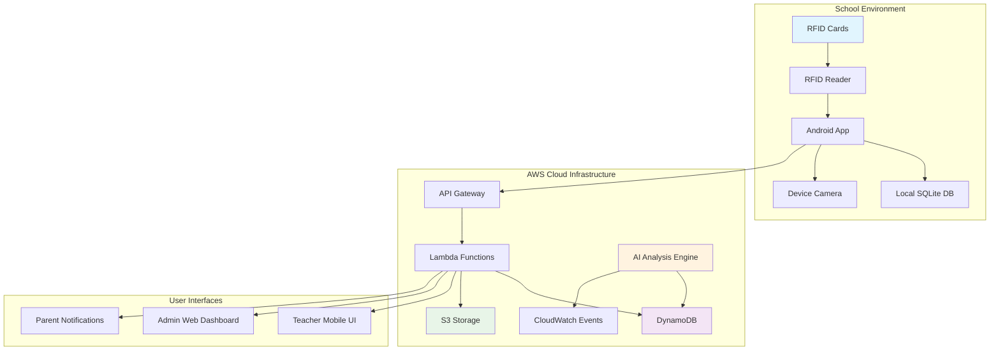
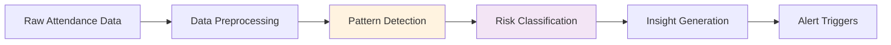

# Design Document: MarkMe AI-Powered Attendance Intelligence System

## Overview

MarkMe is a comprehensive attendance intelligence system designed for rural schools in India, combining RFID-based attendance tracking with AI-powered analytics. The system consists of an Android mobile application, cloud-based data processing infrastructure, and intelligent analysis capabilities optimized for low-resource environments.

The architecture follows an offline-first approach where the Android application can function independently during network outages, automatically synchronizing data when connectivity is restored. The system leverages AWS cloud services for scalable data storage, processing, and AI analysis while maintaining cost-effectiveness suitable for rural educational institutions.

Key design principles include:
- **Offline-first operation**: Full functionality without internet connectivity
- **Low-cost hardware**: Compatible with entry-level Android devices and basic RFID readers
- **Scalable cloud architecture**: AWS services optimized for educational workloads
- **Privacy-focused AI**: Analysis of attendance patterns without individual surveillance
- **Simple user experience**: Minimal training required for teachers and administrators

## Architecture

The system follows a three-tier architecture with clear separation between presentation, business logic, and data layers:



### Component Responsibilities

**Android Application Layer:**
- RFID card reading and validation
- Local data storage and offline operation
- Photo capture for verification
- Data synchronization with cloud services
- Teacher interface for session management

**AWS Cloud Layer:**
- **API Gateway**: RESTful API endpoints for mobile app communication
- **Lambda Functions**: Serverless business logic processing
- **DynamoDB**: NoSQL database for attendance records and metadata
- **S3**: Object storage for verification photos and generated reports
- **AI Analysis Engine**: Machine learning pipeline for pattern analysis

**Data Synchronization:**
- Bidirectional sync between local SQLite and cloud DynamoDB
- Conflict resolution using timestamp-based last-writer-wins strategy
- Batch upload optimization for low-bandwidth environments
- Retry mechanisms with exponential backoff for failed operations

## Components and Interfaces

### Android Application Components

**AttendanceManager**
```typescript
interface AttendanceManager {
  startSession(classId: string, teacherId: string): Promise<SessionId>
  endSession(sessionId: SessionId): Promise<void>
  recordAttendance(sessionId: SessionId, rfidId: string): Promise<AttendanceRecord>
  syncWithCloud(): Promise<SyncResult>
}
```

**RFIDReader**
```typescript
interface RFIDReader {
  initialize(): Promise<void>
  readCard(): Promise<RFIDData>
  isCardPresent(): boolean
  getLastError(): RFIDError | null
}
```

**LocalDatabase**
```typescript
interface LocalDatabase {
  storeAttendance(record: AttendanceRecord): Promise<void>
  getPendingSync(): Promise<AttendanceRecord[]>
  markSynced(recordIds: string[]): Promise<void>
  getSessionData(sessionId: SessionId): Promise<SessionData>
}
```

**PhotoVerification**
```typescript
interface PhotoVerification {
  shouldTriggerVerification(): boolean
  capturePhoto(): Promise<PhotoData>
  uploadPhoto(photo: PhotoData, recordId: string): Promise<string>
}
```

### Cloud Service Interfaces

**AttendanceAPI**
```typescript
interface AttendanceAPI {
  syncAttendanceRecords(records: AttendanceRecord[]): Promise<SyncResponse>
  getStudentRiskClassification(studentId: string): Promise<RiskLevel>
  generateAttendanceReport(params: ReportParams): Promise<ReportData>
  getSessionSummary(sessionId: SessionId): Promise<SessionSummary>
}
```

**AIAnalysisEngine**
```typescript
interface AIAnalysisEngine {
  analyzeAttendancePatterns(studentId: string): Promise<PatternAnalysis>
  classifyStudentRisk(attendanceHistory: AttendanceRecord[]): Promise<RiskLevel>
  generateInsights(classId: string, timeRange: DateRange): Promise<Insights>
  detectAnomalies(records: AttendanceRecord[]): Promise<Anomaly[]>
}
```

**NotificationService**
```typescript
interface NotificationService {
  sendParentAlert(studentId: string, alertType: AlertType): Promise<void>
  sendWeeklySummary(parentId: string, summary: WeeklySummary): Promise<void>
  notifyTeacher(teacherId: string, notification: TeacherNotification): Promise<void>
}
```

## Data Models

### Core Entities

**AttendanceRecord**
```typescript
interface AttendanceRecord {
  id: string
  sessionId: string
  studentId: string
  rfidId: string
  timestamp: Date
  verificationPhotoUrl?: string
  syncStatus: 'pending' | 'synced' | 'failed'
  deviceId: string
  location?: GeoLocation
}
```

**AttendanceSession**
```typescript
interface AttendanceSession {
  id: string
  classId: string
  teacherId: string
  startTime: Date
  endTime?: Date
  status: 'active' | 'ended' | 'cancelled'
  totalStudents: number
  presentCount: number
  verificationCount: number
}
```

**Student**
```typescript
interface Student {
  id: string
  rfidId: string
  name: string
  classId: string
  parentContactInfo: ContactInfo
  enrollmentDate: Date
  riskLevel: 'low' | 'medium' | 'high'
  lastRiskUpdate: Date
}
```

**AttendancePattern**
```typescript
interface AttendancePattern {
  studentId: string
  weeklyAttendanceRate: number
  monthlyTrend: 'improving' | 'declining' | 'stable'
  consecutiveAbsences: number
  irregularityScore: number
  lastAnalysisDate: Date
}
```

### Database Schema Design

**DynamoDB Table Structure:**

*AttendanceRecords Table*
- Partition Key: `studentId`
- Sort Key: `timestamp`
- GSI1: `sessionId` (PK) + `timestamp` (SK) for session-based queries
- GSI2: `classId` + `date` for class-level reporting

*Students Table*
- Partition Key: `studentId`
- GSI1: `classId` for class-based queries
- GSI2: `rfidId` for RFID-based lookups

*Sessions Table*
- Partition Key: `sessionId`
- GSI1: `teacherId` + `startTime` for teacher history
- GSI2: `classId` + `date` for class session tracking

### Data Synchronization Strategy

**Offline Storage:**
- SQLite database with identical schema to cloud storage
- Automatic conflict resolution using timestamp comparison
- Batch synchronization to minimize network usage
- Local data retention for 30 days after successful sync

**Sync Process:**
1. Collect pending local records
2. Upload in batches of 50 records
3. Download server updates since last sync
4. Resolve conflicts using last-writer-wins
5. Update local sync timestamps
6. Retry failed uploads with exponential backoff

## AI Analysis Architecture

### Pattern Detection Engine

The AI analysis system processes attendance data to identify meaningful patterns and generate actionable insights without compromising student privacy.

**Analysis Pipeline:**


**Key Analysis Components:**

*Attendance Pattern Analyzer*
- Calculates weekly and monthly attendance rates
- Identifies sudden drops in attendance (>20% decrease)
- Detects irregular patterns (inconsistent daily attendance)
- Tracks consecutive absence streaks

*Risk Classification Algorithm*
- **Low Risk**: >90% attendance, consistent patterns
- **Medium Risk**: 70-90% attendance or irregular patterns
- **High Risk**: <70% attendance or >5 consecutive absences

*Trend Analysis*
- Moving averages for attendance rates
- Seasonal pattern detection (monsoon, harvest seasons)
- Comparative analysis against class and school averages
- Early warning indicators for intervention needs

### Machine Learning Models

**Attendance Prediction Model:**
- Input features: Historical attendance, day of week, weather patterns, local events
- Algorithm: Time series forecasting using LSTM networks
- Output: Probability of student attendance for upcoming days
- Training: Monthly retraining on aggregated, anonymized data

**Anomaly Detection:**
- Statistical analysis of attendance deviations
- Identification of unusual patterns requiring investigation
- Automated flagging of potential data quality issues
- Integration with verification photo analysis for fraud detection

### Privacy and Ethics

**Data Protection Measures:**
- All analysis performed on aggregated, anonymized datasets
- No individual student tracking or surveillance capabilities
- Compliance with educational data privacy regulations
- Transparent reporting of AI decision-making processes

**Bias Mitigation:**
- Regular auditing of risk classification accuracy across demographic groups
- Adjustment factors for known seasonal and cultural attendance patterns
- Human oversight requirements for high-stakes decisions
- Continuous monitoring of algorithmic fairness metrics

## Correctness Properties

*A property is a characteristic or behavior that should hold true across all valid executions of a system-essentially, a formal statement about what the system should do. Properties serve as the bridge between human-readable specifications and machine-verifiable correctness guarantees.*

### Session Management Properties

**Property 1: Session Creation Consistency**
*For any* valid teacher and class combination, starting an attendance session should create a new session with unique identifier, timestamp, and correct class details
**Validates: Requirements 2.1, 2.5**

**Property 2: Active Session Attendance Recording**
*For any* active attendance session and valid RFID card, the system should successfully record attendance with accurate timestamp
**Validates: Requirements 2.2, 3.2**

**Property 3: Session State Transitions**
*For any* attendance session, ending the session should prevent further check-ins and update session status correctly
**Validates: Requirements 2.3**

**Property 4: Session Timeout Behavior**
*For any* attendance session left open, the system should automatically close it after 2 hours
**Validates: Requirements 2.4**

### RFID and Attendance Properties

**Property 5: RFID Reading Consistency**
*For any* valid RFID card presented to the reader, the system should read and return the unique card identifier within 2 seconds
**Validates: Requirements 3.1, 3.5**

**Property 6: Duplicate Prevention**
*For any* student attempting to mark attendance multiple times in the same session, only the first attempt should be recorded
**Validates: Requirements 3.4**

**Property 7: Invalid Card Rejection**
*For any* invalid or unregistered RFID card, the system should reject the attendance attempt and display appropriate error message
**Validates: Requirements 3.3**

### Data Synchronization Properties

**Property 8: Offline Operation Continuity**
*For any* attendance recording operation when offline, the system should store data locally and continue functioning normally
**Validates: Requirements 11.1, 4.2**

**Property 9: Sync Completeness**
*For any* set of locally stored attendance records, when connectivity returns, all records should be successfully synchronized to the cloud
**Validates: Requirements 11.3, 4.1**

**Property 10: Local Storage Capacity**
*For any* sequence of offline attendance recordings up to 1000 records, the system should store all records without data loss
**Validates: Requirements 11.2**

**Property 11: Conflict Resolution Consistency**
*For any* sync conflict between local and cloud data, the system should apply consistent resolution rules and flag discrepancies
**Validates: Requirements 11.5**

### Photo Verification Properties

**Property 12: Random Verification Sampling**
*For any* large set of attendance check-ins, approximately 20% should trigger photo verification requests
**Validates: Requirements 5.1**

**Property 13: Photo-Record Association**
*For any* verification photo captured, it should be correctly associated with the corresponding attendance record
**Validates: Requirements 5.4**

**Property 14: Verification Failure Handling**
*For any* failed or skipped photo verification, the attendance record should be flagged for manual review
**Validates: Requirements 5.5**

### AI Analysis Properties

**Property 15: Risk Classification Consistency**
*For any* student with sufficient attendance history, the AI engine should classify them into exactly one risk category (Low/Medium/High)
**Validates: Requirements 8.1, 8.3**

**Property 16: Pattern Detection Accuracy**
*For any* student attendance data showing clear declining trends or irregular patterns, the AI engine should detect and flag these patterns
**Validates: Requirements 7.2, 7.3**

**Property 17: Risk Update Timeliness**
*For any* student whose attendance patterns change significantly, risk classification should be updated within 24 hours
**Validates: Requirements 8.2**

### Reporting and Analytics Properties

**Property 18: Attendance Percentage Accuracy**
*For any* student or class, calculated attendance percentages should accurately reflect the ratio of present days to total session days
**Validates: Requirements 6.4**

**Property 19: Report Generation Completeness**
*For any* class and time period, daily and weekly summaries should include all attendance sessions and student records
**Validates: Requirements 6.1, 6.2**

### Notification Properties

**Property 20: Absence Alert Triggering**
*For any* student absent for 2 consecutive days, a parent alert should be automatically sent via the preferred communication method
**Validates: Requirements 10.1, 10.4**

**Property 21: Risk Change Notifications**
*For any* student whose risk level increases to Medium or High, relevant teachers and parents should be notified within 24 hours
**Validates: Requirements 8.4, 10.2**

**Property 22: Privacy Preference Compliance**
*For any* parent who has opted out of non-critical notifications, only critical alerts should be sent
**Validates: Requirements 10.5**

### Security and Access Control Properties

**Property 23: Role-Based Access Enforcement**
*For any* user attempting to access system functionality, access should be granted only if their role has appropriate permissions
**Validates: Requirements 12.1**

**Property 24: Audit Trail Completeness**
*For any* data access or modification operation, a complete audit log entry should be created with timestamp and user information
**Validates: Requirements 12.2**

**Property 25: Data Export Integrity**
*For any* data export request, the exported data should match the source records exactly without corruption or omission
**Validates: Requirements 12.4**

## Error Handling

### Network and Connectivity Errors

**Connection Failures:**
- Graceful degradation to offline mode when cloud services are unreachable
- Automatic retry with exponential backoff for transient network errors
- User notification of sync status without blocking core functionality
- Queue management to prevent memory overflow during extended offline periods

**Sync Conflicts:**
- Timestamp-based conflict resolution with manual review flagging
- Data integrity validation before and after sync operations
- Rollback capabilities for failed synchronization attempts
- Detailed logging of all conflict resolution decisions

### Hardware and Device Errors

**RFID Reader Failures:**
- Automatic retry mechanisms for failed card reads
- Fallback to manual student ID entry when RFID is unavailable
- Clear error messages distinguishing hardware vs. software issues
- Diagnostic information for troubleshooting hardware problems

**Camera and Photo Verification Errors:**
- Graceful handling of camera permission denials
- Alternative verification methods when camera is unavailable
- Automatic retry for failed photo uploads
- Local storage of photos when cloud upload fails

**Storage and Memory Errors:**
- Automatic cleanup of old local data when storage is full
- Progressive data compression for long-term offline operation
- Memory usage monitoring and optimization
- Clear user warnings when storage limits are approached

### Data Validation and Business Logic Errors

**Invalid Input Handling:**
- Comprehensive validation of all user inputs and RFID data
- Sanitization of data before storage and transmission
- Clear error messages for validation failures
- Prevention of SQL injection and other security vulnerabilities

**Business Rule Violations:**
- Enforcement of attendance session time limits
- Prevention of attendance recording outside valid time windows
- Validation of teacher permissions for class management
- Consistency checks for student enrollment and class assignments

### AI and Analytics Errors

**Insufficient Data Handling:**
- Graceful degradation when historical data is insufficient for analysis
- Clear indicators when AI insights are not available
- Fallback to basic statistical analysis when ML models fail
- Transparent communication of AI system limitations

**Model Performance Monitoring:**
- Continuous monitoring of AI model accuracy and performance
- Automatic alerts when model performance degrades
- Fallback to previous model versions when updates fail
- Regular validation against known ground truth data

## Testing Strategy

### Dual Testing Approach

The MarkMe system requires comprehensive testing using both unit tests and property-based tests to ensure correctness across all scenarios:

**Unit Tests:**
- Specific examples and edge cases for critical functionality
- Integration testing between Android app and cloud services
- Error condition testing for network failures and hardware issues
- User interface testing for different device configurations
- Security testing for authentication and authorization

**Property-Based Tests:**
- Universal properties that must hold across all valid inputs
- Comprehensive input coverage through randomized test generation
- Verification of system behavior under various load conditions
- Validation of data consistency across offline/online transitions

### Property-Based Testing Configuration

**Testing Framework:** 
- Android: Use [Kotest Property Testing](https://kotest.io/docs/proptest/property-based-testing.html) for Kotlin-based Android components
- Cloud Services: Use [fast-check](https://fast-check.dev/) for TypeScript Lambda functions
- Each property test configured to run minimum 100 iterations
- Seed-based reproducible test runs for debugging failures

**Test Tagging:**
Each property-based test must include a comment referencing its design document property:
```kotlin
// Feature: markme-attendance-system, Property 1: Session Creation Consistency
@Test
fun testSessionCreationConsistency() { ... }
```

### Testing Categories

**Functional Testing:**
- RFID reading and validation across different card types
- Attendance recording under various session states
- Data synchronization between local and cloud storage
- AI analysis accuracy with synthetic attendance patterns
- Notification delivery across different communication channels

**Performance Testing:**
- RFID reading response time under 2 seconds
- Cloud sync performance with large data sets
- Mobile app responsiveness on entry-level devices
- Database query performance with growing data volumes
- AI analysis processing time for large student populations

**Security Testing:**
- Authentication and authorization for all user roles
- Data encryption validation for transit and storage
- Input validation and sanitization testing
- Privacy compliance verification for student data
- Audit trail completeness and integrity

**Reliability Testing:**
- Extended offline operation without data loss
- Recovery from various failure scenarios
- Data consistency during network interruptions
- System behavior under resource constraints
- Long-term operation stability testing

### Integration Testing Strategy

**End-to-End Scenarios:**
- Complete attendance workflow from RFID scan to cloud storage
- Photo verification process including S3 upload and association
- AI analysis pipeline from raw data to risk classification
- Parent notification delivery for various alert types
- Dashboard data display reflecting real-time system state

**Cross-Platform Testing:**
- Android app compatibility across different device manufacturers
- Web dashboard functionality on various browsers and screen sizes
- Cloud service integration across different AWS regions
- Network behavior testing under various connectivity conditions

### Test Data Management

**Synthetic Data Generation:**
- Realistic attendance patterns for various student profiles
- Diverse RFID card identifiers and formats
- Simulated network conditions and failure scenarios
- Representative photo data for verification testing
- Anonymized data sets for AI model training and validation

**Test Environment Isolation:**
- Separate AWS accounts for development, testing, and production
- Isolated databases preventing test data contamination
- Mock services for external dependencies during testing
- Automated test data cleanup and environment reset procedures